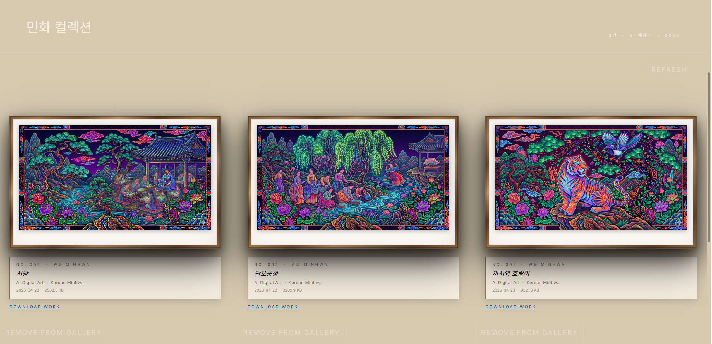
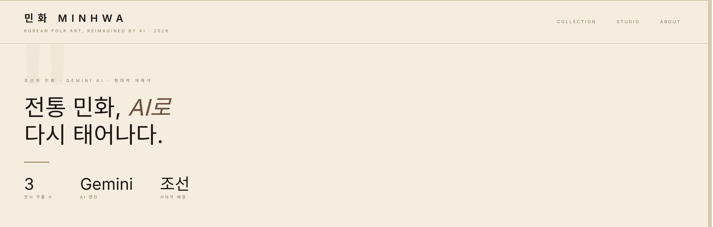
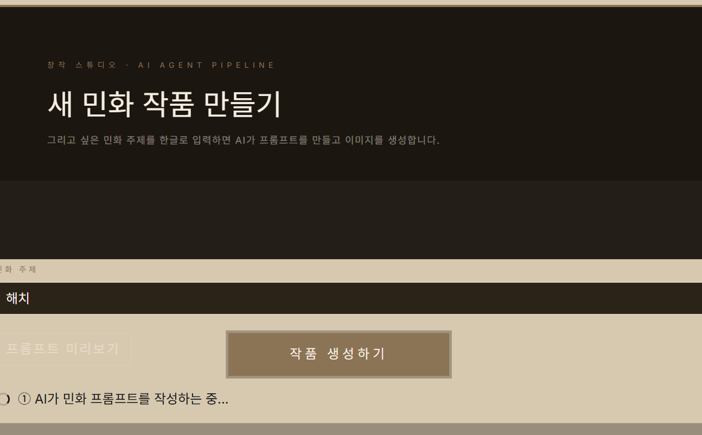
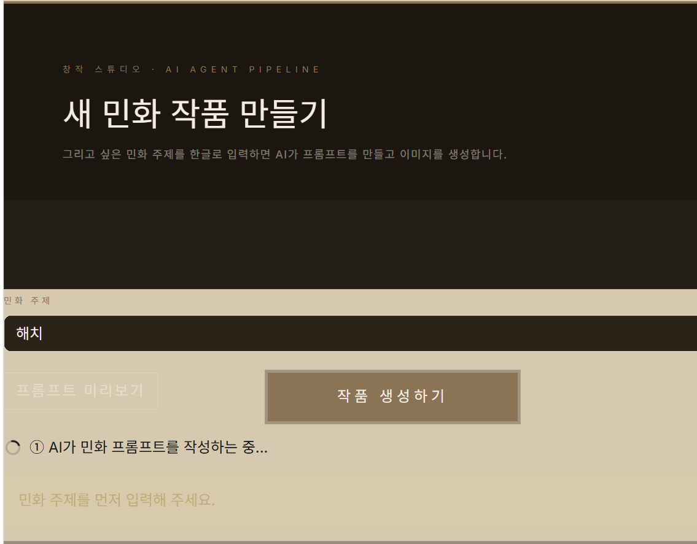
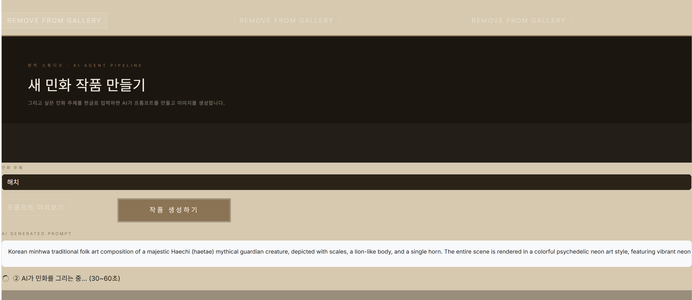
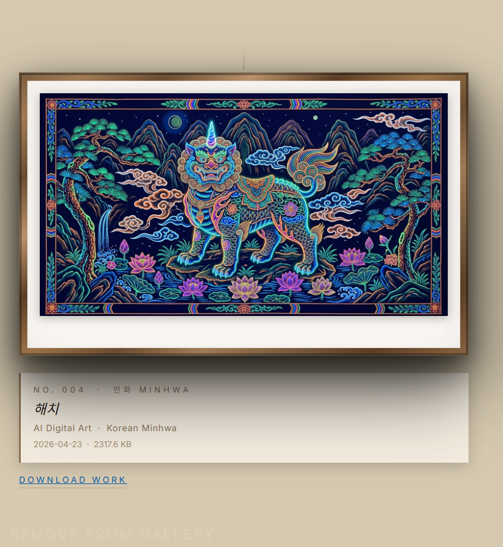

# 민화 MINHWA — AI 갤러리

한국 전통 민화를 Google Gemini AI로 재해석하는 Streamlit 웹 갤러리입니다.

> ⚠️ 첫 접속 시 약 30초 로딩 시간이 있습니다 (Streamlit Cloud 무료 플랜 콜드 스타트)

## 미리보기

| 갤러리 전시 벽 | 뮤지엄 네비게이션 |
|---|---|
|  |  |

### AI 작품 생성 파이프라인

| 주제 입력 | 프롬프트 미리보기 | 이미지 생성 중 | 완성 |
|---|---|---|---|
|  |  |  |  |

### 최종 생성 작품 — 해치



---

## 기술 스택

| 분류 | 기술 |
|---|---|
| UI | Streamlit 1.35+ |
| AI 텍스트 | Gemini 2.5 Flash (한글 → 민화 영문 프롬프트) |
| AI 이미지 | Gemini 3.1 Flash Image Preview |
| 이미지 처리 | Pillow |
| 배포 | Cloudflare Tunnel |

## 기술 아키텍처



## AI 에이전트 파이프라인

```
한글 주제 입력
    ↓
Gemini 2.5 Flash — 민화 스타일 영문 프롬프트 생성
    ↓
Gemini 3.1 Flash Image — 이미지 생성
    ↓
Pillow PNG 변환 → 갤러리 저장
```

## 실행 방법

```bash
# 의존성 설치
pip install -r requirements.txt

# .env 파일 생성
echo "GEMINI_API_KEY=your_api_key_here" > .env

# 실행
streamlit run app.py
```

## 주요 기능

- 한글 주제 입력 → AI 자동 프롬프트 생성 및 미리보기
- 민화 스타일 이미지 자동 생성 및 갤러리 전시
- 미술관 액자 UI (나무 프레임, 뮤지엄 라벨)
- 작품 다운로드 / 삭제 기능
